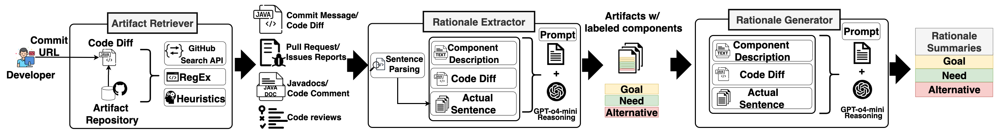

# Recovering Fine-Grained Code Change Rationale from Multiple Software Artifacts

This repository is the replication package for *Recovering Fine-Grained Code Change Rationale from Multiple Software Artifacts*. It contains the dataset, annotation codebook, prompt templates, *ARGUS* implementation, reported experiment results, and user-study instruments used in the paper.

*ARGUS* retrieves artifacts associated with a Java commit, identifies sentences that express **Goal**, **Need**, and **Alternatives**, and synthesizes concise rationale summaries from those sentences.



## Package contents

### Data

- `data/sampled messages.csv` — the original commit-message dataset from Tian et al. (*referenced in Section 3.1: Commit Collection*)
- `data/FilteredCommits.csv` — 830 candidate commits retained after language, atomicity, and size filtering. It includes the sampling indicator for the 63-study-commit sample. (*referenced in Section 3.1: Commit Collection*)
- `data/AnnotatedSentenceData.csv` — sentence-level, multi-label annotations for the 63 sampled commits, including source metadata, relevance labels, development/evaluation-set indicators, and reference rationale summaries. (*referenced in Section 1: Introduction - contribution#6*)
- `data/AnnotationCodebook.csv` — final annotation codebook and decision rules. (*referenced in Section 3.3.2: Rationale Annotation Process*)
- `data/CIPromptTemplate.csv` — rationale-component-identification prompt templates. (*referenced in Section 5.2.1: Prompt Design and Section: 5.5.5 Impact of the LLM on Argus’s Performance*)
- `data/CGPromptTemplate.csv` — rationale-component-generation prompt templates. (*referenced in Section 5.2.1: Prompt Design*)

### Implementation

- `scripts/a_DatasetPreprocessor.py` — filters the original population and prepares the commit input data.
- `scripts/b_ArtifactRetriever.py` — retrieves GitHub artifacts, extracts Javadocs and inline comments, and segments text into sentences.
- `scripts/c_RationaleComponentExtractor.py` — creates and executes component-identification prompts.
- `scripts/d_RationaleComponentGenerator.py` — creates and executes component-generation prompts.
- `scripts/utils/` — shared configuration and helper functions.

### Results

- `results/AnnotatorAgreement.csv` — agreement by annotation round.
- `results/DetailedAnnotationAgreement.csv` — component-level agreement details.
- `results/CommitWiseArtifactCount.csv` and `results/ProjectWiseArtifactCount.csv` — artifact counts after relevance validation.
- `results/ProjectWiseArtifactCount_IrrelevantIncluded.csv` — artifact counts before excluding irrelevant artifacts.
- `results/PromptDevelopmentPerformanceComparisonIndividualVSVoting.pdf` — individual-run versus voting comparison for component identification.
- `results/CI/DevResult.csv` — component-identification prompt-development results.
- `results/CI/EvaluationResult.csv` — component-identification evaluation results for GPT-o4-mini.
- `results/CI/CrossModelEvaluationResult.csv` — cross-model component-identification results.
- `results/CG/DevResult.csv` — component-generation development evaluations.
- `results/CG/EvaluationResult.csv` — component-generation evaluations, including the cross-model evaluations.
- `results/RationaleGenerationSimilarity.csv` — similarity among repeated rationale-generation runs.

### User study 

- `user-study/FinalQuestionnaire.docx` — consent form, demographics questions, commit-evaluation questions, and post-study questions. (*referenced in Section 6.1 Study Design*)
- `user-study/UserStudyCommitDistribution.pdf` — distribution summary for the user-study commit set. (*referenced in Section 6.1 Study Design*)

## Environment setup

The scripts were developed with Python 3.10. They use live GitHub data and LLM APIs, so a GitHub access token and an OpenAI API key are required.

```bash
python -m venv venv
source venv/bin/activate
pip install -r requirements.txt
export OPENAI_TOKEN=<your-openai-api-key>
export GITHUB_TOKEN=<your-github-access-token>
```

Run commands from the repository root (`finegrained-rationale/`).

## Running the pipeline

The pipeline is ordered as follows:

```bash
python scripts/a_DatasetPreprocessor.py
python scripts/b_ArtifactRetriever.py
python scripts/c_RationaleComponentExtractor.py -t test
python scripts/d_RationaleComponentGenerator.py -t test
```
